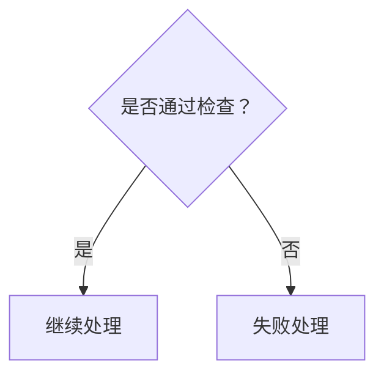

# Draw.io to Mermaid Converter

Convert draw.io XML files (`.drawio`, `.drawio.xml`) into well-structured Mermaid flowchart diagrams.

## Workflow

### Step 1: Read the draw.io file

Read the user's `.drawio` or `.drawio.xml` file. These files are standard XML with the following structure:

```xml
<mxfile>
  <diagram name="Page Name" id="...">
    <mxGraphModel>
      <root>
        <mxCell id="0"/>
        <mxCell id="1" parent="0"/>  <!-- background layer -->
        <!-- vertices and edges follow -->
      </root>
    </mxGraphModel>
  </diagram>
</mxfile>
```

### Step 2: Parse and classify mxCells

Iterate over every `<mxCell>` element and classify:

| Attribute | Meaning |
|---|---|
| `vertex="1"` | A node (shape) |
| `edge="1"` | A connection between nodes |
| `parent="1"` | Belongs to the main drawing layer |
| `connectable="0"` | An edge label (not a real vertex) |

**For vertices** (`vertex="1"`), extract:
- `id` — unique identifier
- `value` — the text content (may contain HTML entities and tags)
- `style` — shape, colors, and formatting
- `mxGeometry` — x, y, width, height position

**For edges** (`edge="1"`), extract:
- `source` — source vertex id
- `target` — target vertex id
- `value` — edge label text (if present)
- `style` — stroke color, width, dash pattern
- Child `mxCell` elements with `connectable="0"` — these are the edge labels

### Step 3: Clean text content

Draw.io stores text as HTML. Clean it before using in Mermaid:

1. Strip HTML tags (`<div>`, `<span>`, `<font>`, `<br>`, etc.)
2. Decode HTML entities: `&lt;` → `<`, `&gt;` → `>`, `&amp;` → `&`, `&quot;` → `"`
3. Replace `&nbsp;` with a regular space
4. Collapse multiple whitespace/newlines — keep at most one `<br>` equivalent per line break
5. Trim leading/trailing whitespace

Keep the text concise. For long labels (e.g., multi-condition diamonds), prefer line breaks for readability.

### Step 4: Map shapes to Mermaid syntax

| draw.io shape | style keyword | Mermaid syntax |
|---|---|---|
| Rectangle (default) | `rounded=1` (optional) | `A[Text]` |
| Diamond / Rhombus | `rhombus` | `A{Text}` |
| Hexagon | `shape=hexagon` | `A{{Text}}` |
| Ellipse / Circle | `ellipse` | `A((Text))` |
| Parallelogram | `shape=parallelogram` | `A[/Text/]` |
| Cylinder (database) | `shape=cylinder` | `A[(Text)]` |
| Subprocess / rounded rect | `rounded=1` | `A(Text)` |

If a shape type is unrecognized, default to rectangle `A[Text]`.

### Step 5: Map colors to Mermaid classDef

Extract `fillColor` and `strokeColor` from each vertex's style. Map them to Mermaid `classDef` entries:

```
Mermaid classDef naming: use semantic or color-based names
- Green (#d5e8d4/#82b366) → classDef green fill:#d5e8d4,stroke:#82b366
- Red (#f8cecc/#b85450) → classDef red fill:#f8cecc,stroke:#b85450
- Yellow (#fff2cc/#d6b656) → classDef yellow fill:#fff2cc,stroke:#d6b656
- Blue (#dae8fc/#6c8ebf) → classDef blue fill:#dae8fc,stroke:#6c8ebf
- Orange (#ffe6cc/#d79b00) → classDef orange fill:#ffe6cc,stroke:#d79b00
- Purple (#e1d5e7/#9673a6) → classDef purple fill:#e1d5e7,stroke:#9673a6
- White/default → classDef default fill:#fff,stroke:#666
```

Assign class names to nodes using `class NODE_ID className` after the graph. Use semantic names when the color has obvious meaning (e.g., `classDef stop fill:#f8cecc` for red error/stop nodes).

Map edge stroke colors similarly where the edge has a distinct color from default.

### Step 6: Build the flow graph

Trace edges to determine flow direction. Draw.io uses explicit `source` → `target` on each edge.

**Determine flow direction:**
- Compare Y-coordinates of connected nodes: if most targets are below their sources, use `flowchart TD` (top-down)
- Compare X-coordinates: if most targets are to the right, use `flowchart LR`
- Default to `flowchart TD`

**Detect and handle duplicates:**
Draw.io files often contain duplicate/overlapping nodes with different IDs but identical text and position. The same visual structure may be stored in two sets of `mxCell` elements. To detect:

1. Group vertices by their cleaned text content
2. If two vertices share the same text AND are within 5px of each other in both X and Y, they are duplicates — keep only one (prefer the one with a lower `id`, as it was created first)
3. Remap edge connections: if an edge pointed to a removed duplicate, redirect to the kept node

**Trace the main flow:**
1. Start from the node with the smallest Y-coordinate (topmost)
2. Follow edges: for each node, find its outgoing edges
3. Handle branching:
   - **Decision nodes** (diamond/rhombus) have multiple outgoing edges — each gets a labeled branch
   - **Process nodes** (rectangle) typically have one outgoing edge
4. Detect loops: edges that go back upward form feedback loops

**Edge labels:**
- If an edge has a child `mxCell` with `connectable="0"`, use its `value` as the label
- If the edge itself has a `value`, use that
- Format in Mermaid: `A -- 标签 --> B` or `A -->|标签| B`

**Floating edges** (no explicit source/target, only `sourcePoint`/`targetPoint` in `mxGeometry`):
- These connect via geometric position. Match them to the nearest vertex at the source/target point
- If matching is ambiguous, include them as comments or skip

### Step 7: Generate and write Mermaid output

Write the output to a `.md` file alongside the source file (same directory, same base name with `_mermaid.md` suffix).

**Output format:**
````markdown
# [Diagram Name]

```mermaid
flowchart TD
    %% node definitions
    NODE_ID["Node Label"]
    ...

    %% edges with labels
    NODE_A --> NODE_B
    NODE_C -- 是 --> NODE_D
    NODE_E -->|否| NODE_F

    %% style classes
    classDef ...
    class NODE_ID className
```
````

**Naming nodes in Mermaid:**
- Generate short, unique IDs: use the draw.io numeric id prefixed with `N` (e.g., `N3`, `N15`) for traceability
- Alternatively, for very complex diagrams, use semantic camelCase names based on the node's text content (transliterate Chinese to pinyin if needed)

**Layout hints:**
- Group related nodes with `subgraph` when the diagram shows clear grouping
- For large diagrams, add `%%` comments to separate logical sections

## Edge Cases

### Swimlane / container shapes
If a vertex has child cells (other cells with `parent="<swimlane-id>"`), treat it as a container. In Mermaid, use `subgraph` to represent it.

### Multiple diagram pages
A `.drawio` file can contain multiple `<diagram>` elements. Process each one into a separate Mermaid code block within the same `.md` file, labeled by their `name` attribute.

### Edge routing points
If an edge contains `<Array as="points">` with `<mxPoint>` entries, these are waypoints for visual routing. They don't affect the logical connection — ignore them for the Mermaid output, but they can help confirm flow direction.

### Invisible / helper edges
Edges without labels and without a visible style (no strokeColor, thin strokeWidth) may be structural helpers. Keep them if they represent real flow; skip if they only exist for layout.

### Conflicting edge sources
When multiple edges originate from the same node, determine their order by the `exitX`/`exitY` values:
- `exitY=0` → top exit → goes upward
- `exitY=1` → bottom exit → goes downward
- `exitX=0` → left exit → goes left (often "否" branch)
- `exitX=1` → right exit → goes right (often "是" branch)

This helps infer which branch is "yes" and which is "no" in decision diamonds.

## Example

**Input:** A draw.io diamond `{是否通过检查？}` with two exits — left goes to `[失败处理]`, bottom goes to `[继续处理]`.

**Output:**


## After Writing the Output

After generating the Mermaid `.md` file:
1. Tell the user the output path
2. Summarize the converted flow in 3-5 bullets
3. Note any nodes/edges that were ambiguous or skipped
4. Mention that they can paste the Mermaid code into [mermaid.live](https://mermaid.live) or a VS Code Mermaid preview plugin to verify the rendering
